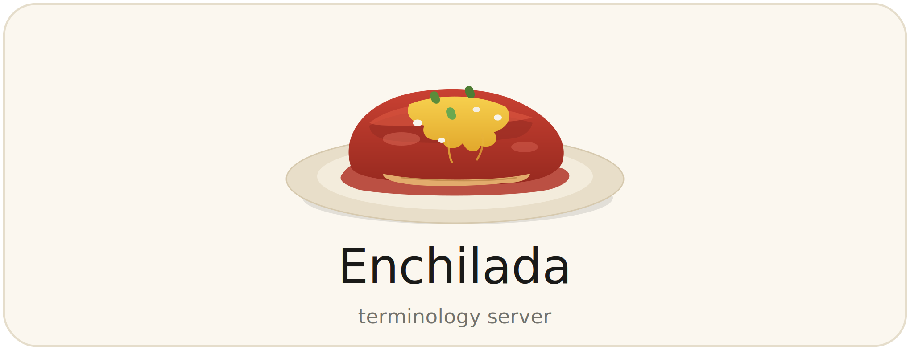

# enchilada


**[Documentation](https://croeder.github.io/enchilada/)**

A minimal, local FHIR R4/R5 terminology server implementing a subset of the standard FHIR terminology
API, backed by an on-disk copy of the OMOP vocabularies. This implementation does not deal with 
rate limits, licenses or production-level volume. It is meant for local development or demonstration and 
adherence to the FHIR standards.

## Purpose

Matchbox calls an external FHIR terminology server to resolve source codes (SNOMED, ICD,
RxNorm, etc.) to OMOP concept IDs during `$transform` operations. This project provides a
local alternative for offline use, deterministic results, and no external network dependency.

## API surface

The FHIR R4/R5 terminology API defines six operations across three resource types. This project
implements the subset relevant to concept translation, exposed under both `/r4/` and `/r5/`
prefixes. The two versions share identical translate logic and response shapes; they differ only
in the `fhirVersion` field returned by `GET /rN/metadata`.

| Resource | Interactions | Operations |
|---|---|---|
| `ConceptMap` | read, search-type | **$translate** ← primary target |
| `CodeSystem` | read, search-type | lookup, validate-code, subsumes |
| `ValueSet` | read, search-type | expand, validate-code |

Not implemented: `ConceptMap/$closure` (transitive closure table for search-time subsumption).
All implemented operations are standard FHIR — no proprietary extensions.

Initial implementation focuses on `ConceptMap/$translate`. The others can be added
incrementally as needed.

### ConceptMap/$translate

```
POST /r4/ConceptMap/$translate
POST /r5/ConceptMap/$translate
```

Both endpoints accept and return the same FHIR Parameters resource format.

Parameters:
- `system` — source vocabulary URI (e.g. `http://snomed.info/sct`)
- `code` — source code (e.g. `38341003`)
- `targetsystem` — target vocabulary URI (e.g. `http://ohdsi.org/omop`)

**Match found** — HTTP 200:
```json
{
  "resourceType": "Parameters",
  "parameter": [
    { "name": "result", "valueBoolean": true },
    { "name": "match", "part": [
      { "name": "equivalence", "valueCode": "equivalent" },
      { "name": "concept", "valueCoding": {
        "system": "http://ohdsi.org/omop",
        "code": "316866"
      }}
    ]}
  ]
}
```

**No match found** — HTTP 200 (per FHIR spec; `$translate` is an operation returning a
result, not a resource lookup, so 404 does not apply):
```json
{
  "resourceType": "Parameters",
  "parameter": [
    { "name": "result", "valueBoolean": false },
    { "name": "message", "valueString": "No mapping found for SNOMED#38341003" }
  ]
}
```

The `message` parameter is defined in the FHIR spec as optional on both match and no-match;
here it is always populated on no-match to aid debugging.

## Data source

### CONCEPT.csv (available locally)

`/Users/croeder/git/CCDA/tislab-clad/CCDA_OMOP_Private/CONCEPT.csv`

- 7.4M rows, 965 MB
- Columns: `concept_id`, `concept_name`, `domain_id`, `vocabulary_id`, `concept_class_id`,
  `standard_concept`, `concept_code`, `valid_start_date`, `valid_end_date`, `invalid_reason`
- Standard concepts marked `standard_concept = 'S'`
- Confirmed: SNOMED 38341003 (hypertensive disorder) → concept_id 316866 present

### CONCEPT_RELATIONSHIP.csv (needs Athena download)

Not present locally. Required to translate non-standard source codes via the `Maps to`
relationship. Download from [Athena](https://athena.ohdsi.org) — select vocabularies
SNOMED, ICD10CM, ICD9CM, RxNorm, LOINC at minimum.

## Technology

- **Python + FastAPI** — minimal REST layer; one route handler per operation
- **SQLite** — point-lookup database loaded from CONCEPT.csv at startup; indexed on
  `(concept_code, vocabulary_id)`. SQLite is purpose-built for OLTP point lookups and
  a better fit than DuckDB (which is optimized for analytical scans, not single-row
  lookups over 7M rows). The CSV is loaded into a SQLite file once on first run;
  subsequent server starts reuse the existing file.
- **Reference**: `/Users/croeder/git/omop_on_duckdb/` — existing OMOP CSV loading patterns

## Configuration

`config.yaml`:
```yaml
server:
  host: 0.0.0.0
  port: 8081

data:
  concept_csv: /Users/croeder/git/CCDA/tislab-clad/CCDA_OMOP_Private/CONCEPT.csv
  concept_relationship_csv: null   # set path when available
  sqlite_db: ./enchilada.db        # created on first run, reused thereafter
```

Optional TLS — required when matchbox runs in Docker because HAPI's OkHttp client forces a
TLS handshake even for `http://` URLs. Omit these keys for plain-HTTP local development.

```yaml
server:
  ssl_certfile: /certs/enchilada.crt
  ssl_keyfile:  /certs/enchilada.key
```

Generate a self-signed cert and import it into a Java truststore (see `matchbox_scripts/certs/`):

```bash
openssl req -x509 -newkey rsa:2048 -keyout enchilada.key -out enchilada.crt \
  -days 3650 -nodes -subj "/CN=enchilada" \
  -addext "subjectAltName=DNS:enchilada,DNS:localhost,IP:127.0.0.1"

keytool -importcert -file enchilada.crt -keystore enchilada.jks \
  -storepass changeit -alias enchilada -noprompt
```

## Translation logic

For `ConceptMap/$translate` given `(system, code, targetsystem)`:

> **Known matchbox bug — system URI missing from $translate POST body**
>
> When an FML `translate()` call uses an empty ConceptMap URL (e.g. `translate(coding, '', 'code')`),
> matchbox sends a POST body with only `{"name":"code","valueCode":"..."}` — the `system` parameter
> is absent. This was observed empirically: the Coding variable `sc` in the FML pattern
> `src.code.coding first as sc -> tgt.field = translate(sc, '', 'code')` has its system URI stripped
> before the HTTP request is built. FHIR-compliant servers must return 400 if `system` is absent;
> echidna (public hosted server) accepts system-absent lookups as a courtesy.
>
> Enchilada works around this by falling back to a cross-vocabulary search over all standard concepts
> when `system` is absent. First match wins — unambiguous in practice given the Athena vocabulary set.
>
> **Upstream bug location**: `matchbox-engine/src/main/java/ch/ahdis/matchbox/mappinglanguage/`
> — either `MatchboxStructureMapUtilities.translate()` (the `getProperty("system",...)` call that
> reconstructs the Coding from the FML element-model variable) or `ConceptMapEngine.translateViaTxServer()`
> (the `source.hasSystem()` gate before adding system to the Parameters). Unit tests are in
> `TranslateCodingSystemTests.java` (class `WhenFmlUsesCodingFirstExtraction`). These tests isolate
> whether the system is dropped at the FML binding step or at the tx-server request step.

1. Map FHIR vocabulary URI → OMOP `vocabulary_id`:

| FHIR URI | OMOP vocabulary_id |
|---|---|
| `http://snomed.info/sct` | `SNOMED` |
| `http://hl7.org/fhir/sid/icd-10-cm` | `ICD10CM` |
| `http://hl7.org/fhir/sid/icd-9-cm` | `ICD9CM` |
| `http://www.nlm.nih.gov/research/umls/rxnorm` | `RxNorm` |
| `http://loinc.org` | `LOINC` |

2. Query SQLite `CONCEPT` for `concept_code = code` AND `vocabulary_id = <mapped>` AND
   `standard_concept = 'S'` → return `concept_id` directly.

3. If not found as a standard concept, join through `CONCEPT_RELATIONSHIP` on
   `relationship_id = 'Maps to'` to find the standard concept (requires Athena download).

4. If still not found, return `result=false` with a descriptive `message`.

## Test cases

Two known-good codes confirmed against the local CONCEPT.csv:

| Input system | code | Expected concept_id |
|---|---|---|
| `http://snomed.info/sct` | `38341003` (hypertensive disorder) | `316866` |
| `http://snomed.info/sct` | `386661006` (fever) | `437663` |

## Development

FastAPI serves a Swagger UI at `http://localhost:8081/docs` and ReDoc at
`http://localhost:8081/redoc`. Both are available automatically with no extra configuration.

FHIR operation paths use `$` (e.g. `/r4/ConceptMap/$translate`, `/r5/ConceptMap/$translate`).
The `$` is a valid URL character and FastAPI handles it without escaping; it appears literally
in the Swagger UI.

## Matchbox integration

Use the `/r4/` prefix when connecting a FHIR R4 matchbox instance, `/r5/` for R5.

Local development (plain HTTP):
```yaml
matchbox:
  fhir:
    context:
      txServer: http://localhost:8081/r4   # or /r5 for R5 matchbox
      translateMode: server
```

Docker (TLS required — HAPI forces TLS even on plain-http URLs):
```yaml
matchbox:
  fhir:
    context:
      txServer: https://enchilada:8081/r4   # or /r5 for R5 matchbox
      translateMode: fallback
```

Mount the Java truststore into matchbox and set:
```
JAVA_TOOL_OPTIONS=-Djavax.net.ssl.trustStore=/certs/enchilada.jks -Djavax.net.ssl.trustStorePassword=changeit
```

## Out of scope

- Full OMOP vocabulary coverage beyond what's in the Athena download
- Authentication
- Write operations

## License

Licensed under the [Apache License 2.0](./LICENSE). Copyright 2026 Christophe Roeder.

enchilada serves OMOP vocabulary content loaded from Athena. Individual vocabularies carry their own license terms — see [NOTICES.md](https://github.com/croeder-fhir-to-omop/.github/blob/main/profile/NOTICES.md) for details.

See the [organization README](https://github.com/croeder-fhir-to-omop) for full pipeline documentation.
